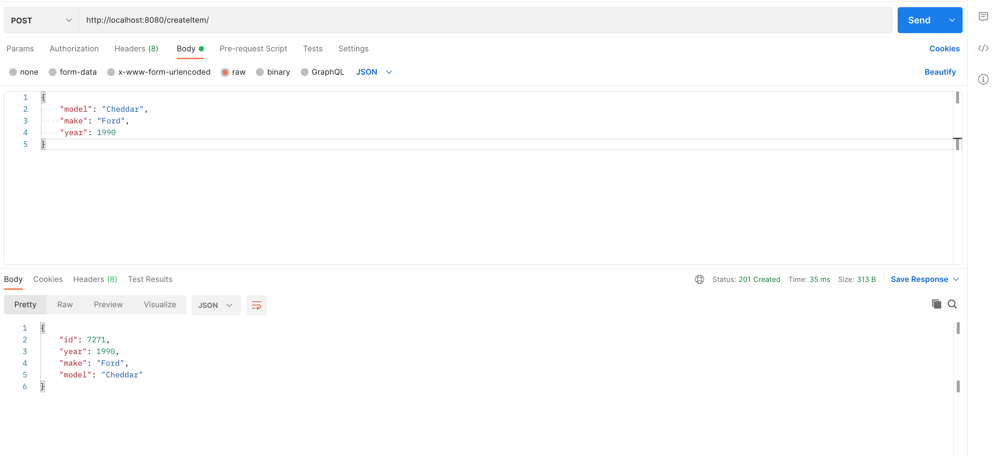
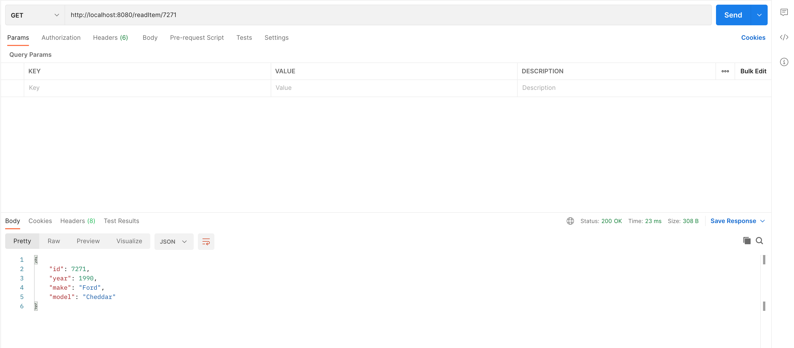
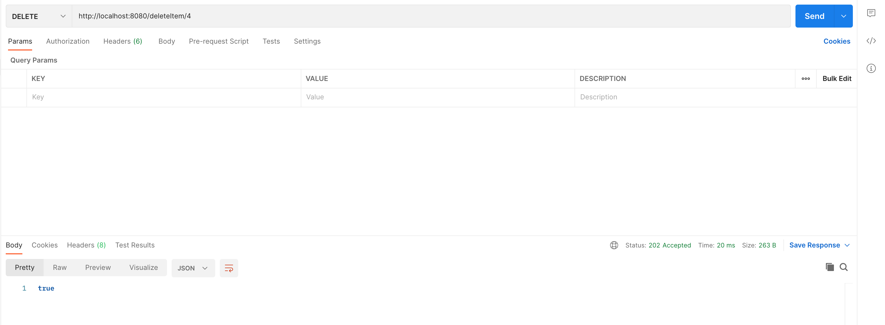
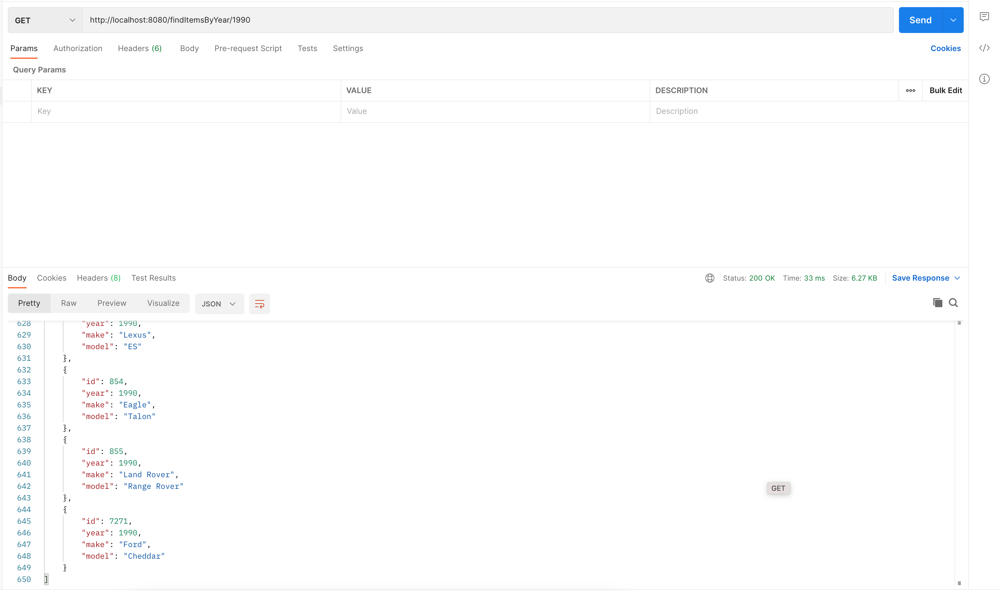
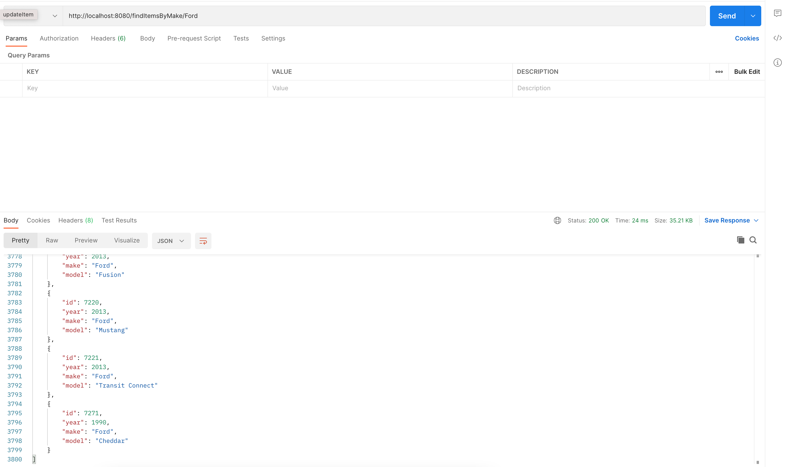
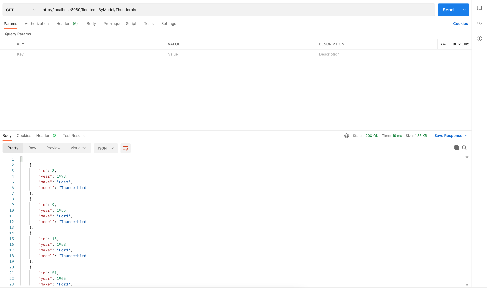

<h1 align="center">
  <a href="https://github.com/harrykriches@gmail.com/basic-car-api">
    <!-- Please provide path to your logo here -->
    
  </a>
</h1>

  Basic Car Api

 

## About

Screenshots

 

> **[?]**
> Please provide your screenshots here.

|                               Home Page                               |                               Login Page                               |
| :-------------------------------------------------------------------: | :--------------------------------------------------------------------: |
|  |  |

### Built With

> **[?]**
> Please provide the technologies that are used in the project.

## Getting Started

### Installation

I find it useful to have a docker network created for the compose stack. The docker-compose file uses `carApiNetwork` so run:

`docker network create carApiNetwork`

Go into the `car-api-docker` folder and build the docker images:

`docker-compose build --no-cache`

`docker-compose up`

## Why are we doing this?

The API was requested as a final project for the Software Development Bootcamp led by QA. This deliverable utilised technologies such as Java, Spring Boot, MySql, Docker and the testing suites Mockito and Junit.

## How I expected the challenge to go.

I expected to complete the minimum requirements for the project as well as complete some challenges that I set for myself. These extra challenges were to create a frontend for the API and create docker images for each service for easy deployment. I did this because I believe I would have time to complete these extra challenges, but I still accounted for unexpected problems by delegating most of the allocated project time to them.

## What went well? / What didn't go as planned?

I believed I was able to learn the javascript library React and apply this knowledge towards creating a frontend. Unfortunately I did not foresee how much content was needed to learn as well as implement to my project, which I was unable to do in a couple of days.

I resorted to using an apache web server hosted in a docker container

## Possible improvements for future revisions of the project.
## Screenshots showing your postman requests and the output from the API.

---
### Create Item
 

---

### Read Item
 

---

### Update Item
 

---

### Delete Item
 

---

### Read Items By Year
 

---

### Read Items By Make
 

---

### Read Items By Model
 

---

## Screenshots of your database to prove that data is being persisted.

## Screenshot of your test results, including coverage report.
## Link to Jira Board - You must add your trainer(s) as collaborators also.

## Usage

> **[?]**
> How does one go about using it?
> Provide various use cases and code examples here.
