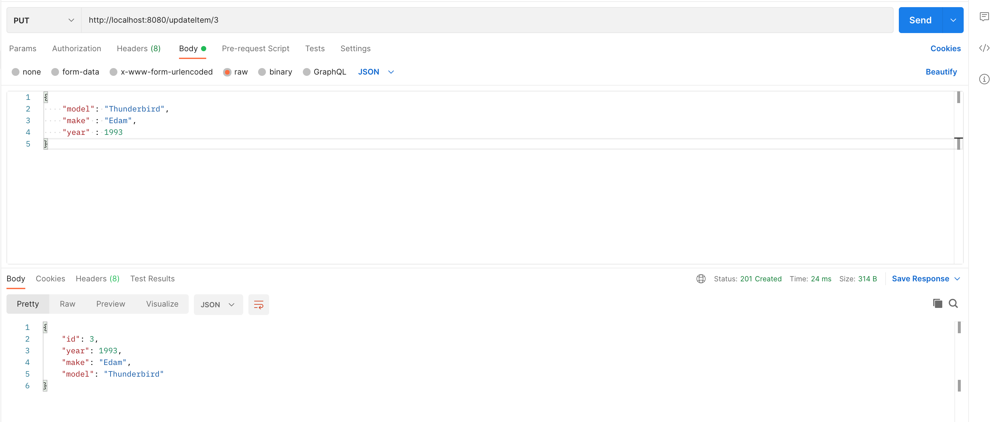

# Basic Car API
## Getting Started

This project contains all the files needed to deploy a local instance which I recommend using the provided docker-compose file for.
### Installation

I find it useful to have a docker network created for the compose stack. The docker-compose file uses `carApiNetwork` so run:

`docker network create carApiNetwork`

Go into the `car-api-docker` folder and build the docker images:

`docker-compose build --no-cache`

Run the stack:

`docker-compose up`

### Things to Know

I have succesfully deployed this project on multiple machines and accessed the frontend through the provided IP address and Port.

### docker-compose (recommended)


```yaml
---

version: '3'
services:
  db:
    build: ./mysql
    container_name: api-database
    restart: on-failure
    environment:
      MYSQL_ROOT_PASSWORD: 'password'
    ports:
      - '3310:3306'
    networks:
      - carApiNetwork
    volumes:
      - ./mysql/data:/var/lib/mysql
  api:
    container_name: car-api
    restart: on-failure
    build: ./car-api
    environment:
      - SPRINGPROFILES=prod
    depends_on:
      - db
    ports:
      - 8080:8080
    networks:
      - carApiNetwork
  frontend:
    container_name: api-frontend
    image: joseluisq/static-web-server:2
    environment:
      - SERVER_CORS_ALLOW_ORIGINS=*
      - SERVER_LOG_LEVEL=debug
      - SERVER_ROOT=/public
    volumes:
      -  ./frontend/files:/public
    ports:
      - 3124:80
    networks:
      - carApiNetwork
networks:
   carApiNetwork:
    external: true
    name: carApiNetwork
```
## Environment Variables

Container images are configured using parameters passed at runtime (such as those above). These parameters are separated by a colon and indicate `<external>:<internal>` respectively. For example, `-p 8080:80` would expose port `80` from inside the container to be accessible from the host's IP on port `8080` outside the container.

| Parameter | Function |
| :----: | --- |
| `-p 7878` | The port for the Radarr webinterface |
| `-e PUID=1000` | for UserID - see below for explanation |
| `-e PGID=1000` | for GroupID - see below for explanation |
| `-e TZ=Europe/London` | Specify a timezone to use EG Europe/London, this is required for Radarr |
| `-v /config` | Database and Radarr configs |
| `-v /movies` | Location of Movie library on disk (See note in Application setup) |
| `-v /downloads` | Location of download managers output directory (See note in Application setup) |

## Why are we doing this?

The API was requested as a final project for the Software Development Bootcamp led by QA. This deliverable utilised technologies such as Java, Spring Boot, MySql, Docker and the testing suites Mockito and Junit.

## How I expected the challenge to go.

I expected to complete the minimum requirements for the project as well as complete some challenges that I set for myself. These extra challenges were to create a frontend for the API and create docker images for each service for easy deployment. I did this because I believe I would have time to complete these extra challenges, but I still accounted for unexpected problems by delegating most of the allocated project time to them.

## What went well? / What didn't go as planned?

I believed I was able to learn the javascript library React and apply this knowledge towards creating a frontend. Unfortunately I did not foresee how much content was needed to learn as well as implement to my project, which I was unable to do in a couple of days.

I resorted to using an apache web server hosted in a docker container and use a volume bind mount to point towards the root web directory. I used javascript to make fetch requests on the frontend to the exposed port of the database in localhost. I found it difficult to work around issues with CORS, especially trying to resolve docker hostnames as internal IP addresses. Using localhost as a url seemed to work, which is acceptable considering this project is not made to be exposed to the internet for public API access.

One particular issue I was unable to resolve was expecting exceptions when performing tests of the service class in the Java project. This may be a configuration error on my end, but I was able to find a work around by throwing an exception and then asserting it inside the catch of a try/catch statement. This worked fine, but was not a graceful implementation of asserting the exception in my opinion.

## Possible improvements for future revisions of the project.

I have not covered all possible exceptions when sending requests through the REST API. This means that the responses that I receive in the frontend are not handled equally. I would prefer to create more exceptions with greater detail added, so I am able to provide meaningful feedback when a user makes an error.

## Postman Screenshots

Link to Postman Collection is located in the<a href="docs/DFESW12_FP_Cars_API.postman_collection"> documentation </a>   folder

---
### Create Item
<br>


---

### Read Item
<br>


---

### Update Item
<br>


---

### Delete Item
<br>


---

### Read Items By Year
<br>


---

### Read Items By Make
<br>


---

### Read Items By Model
<br>


---

## Database Persistance Evidence

I attached a shell to the mysql docker container and checked executed some commands on the `cars_db` database to see if the postman commands had persisted.

---

### Check to See if Item is Deleted
<br>


---
### Check to See if Item is Updated
<br>


---
### Check to See if Item is Created
<br>


---


## Screenshot of your test results, including coverage report.
   <a href="https://wessexhurst.atlassian.net/jira/software/projects/DFPA/boards/2/roadmap?shared=&atlOrigin=eyJpIjoiMDk2ODIzMmMwMjI4NDVmZWIyOTMzZmVmZDVkYjJjMGMiLCJwIjoiaiJ9">  	Link to Jira Board </a>